# Munual de usuario - GoDrive

## **Introducción**
El presente manual de usuario tiene como objetivo guiar al usuario en el uso de la aplicación web GoDrive, la cual permite a los estudiantes de la Universidad de San Carlos de Guatemala almacenar y compartir archivos de manera segura y eficiente.

## **Requisitos**
Para poder utilizar la aplicación web GoDrive, el usuario debe contar con un navegador web actualizado, preferiblemente Google Chrome o Mozilla Firefox.

### Inicio de sesión
Para poder ingresar a la aplicación web GoDrive, el usuario debe ingresar su identificación y contraseña en la página de inicio de sesión.
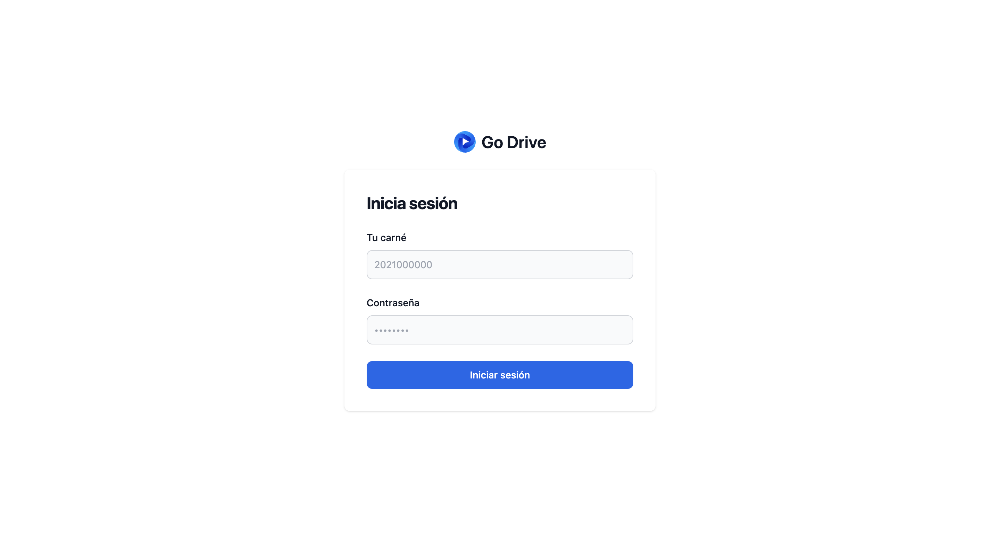

### Opciones de administrador
Si no hay usuarios en el sistema, se mostrará un mensaje de que no existen estudiantes.

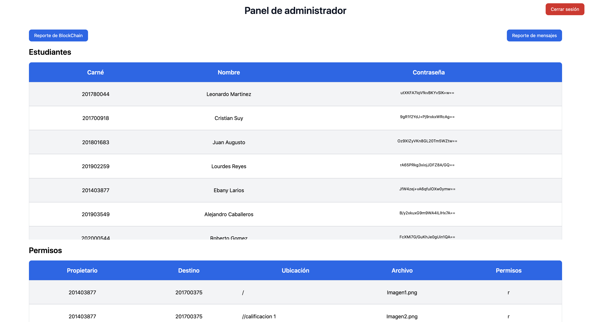

Para poder cargar estudiantes, se debe utilizar el botón de `Carga Masiva`, este debe ser un archivo JSON, si todo es correcto, se mostrará la lista de estudiantes cargados.
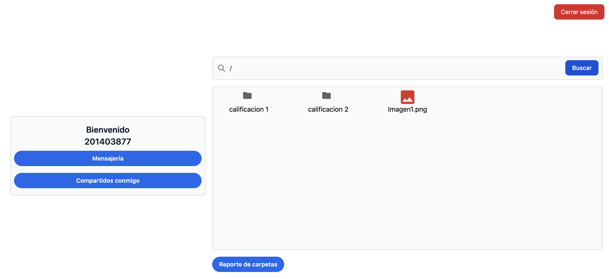

Para mostrar la lista, se podrá escoger entre tres opciones, el recorrido `Preorder`, `Inorder` y `Postorder`.

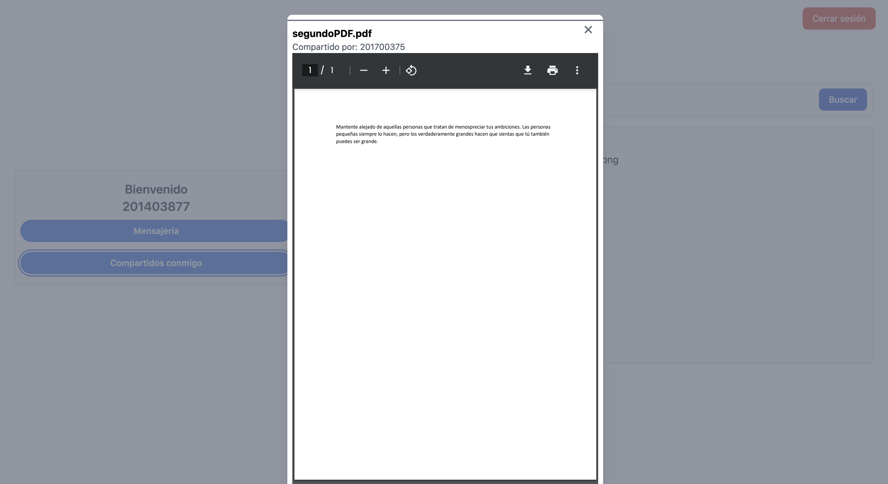

El administrador tendrá la posibilidad de ver el que tiene a todos los estudiantes.
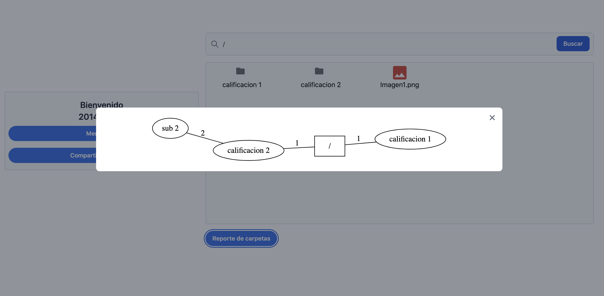

### Opciones de estudiante
El estudiante tendrá un panel donde podrá tener las siguientes funciones:
- Crear una carpeta
- Subir un archivo
- Eliminar una carpeta
- Visualizar el contenido de cada carpeta
- Reporte de las carpetas
- Reporte de los archivos
- Asignar permisos a un archivo
- Ver la actividad de las acciones realizadas

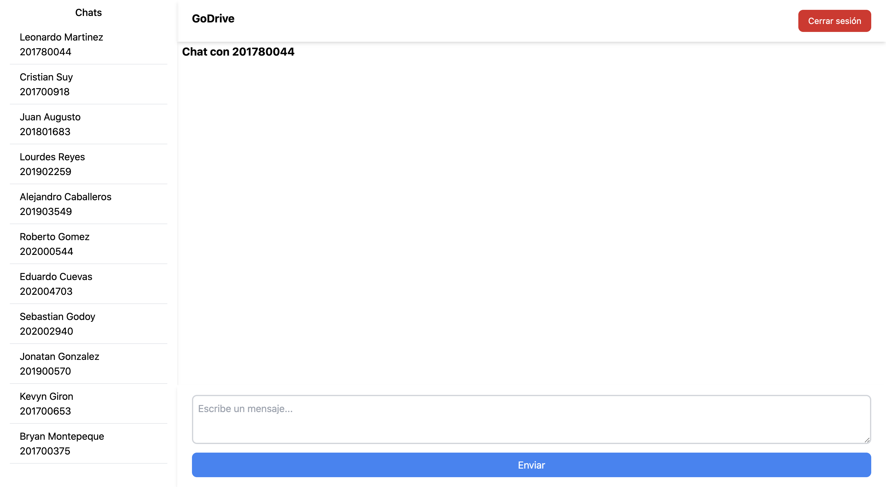

Para crear una carpeta se debe presionar el botón de `Crear carpeta`, se debe ingresar el nombre de la carpeta y esta se creará en la ruta actual.

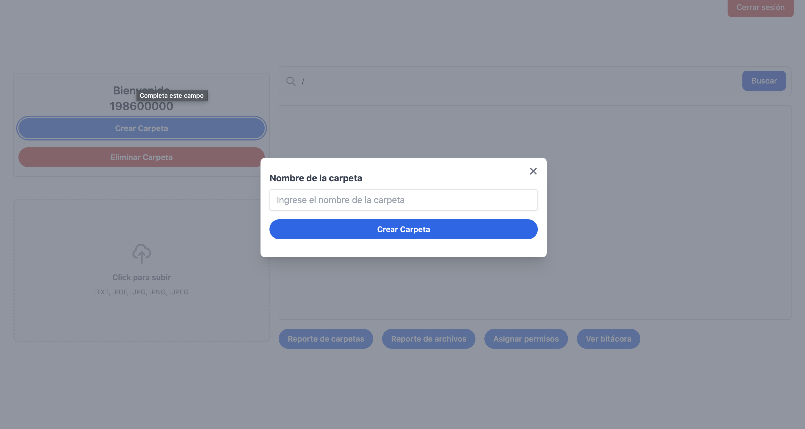

Además se mostrará un mensaje verificando que sí se creó la carpeta.

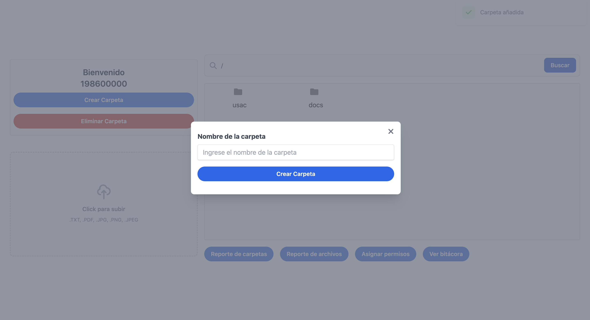

Para eliminar una carpeta se debe presionar el botón de `Eliminar carpeta`, se debe ingresar el nombre de la carpeta y esta se eliminará en la ruta actual.

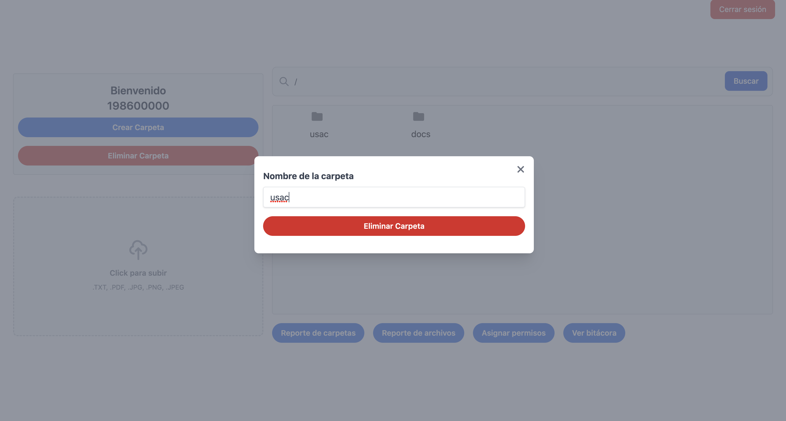

Al presionar el botónd de `Reporte de carpetas` se mostrará una imagen en forma de árbol que contiene las carpetas.

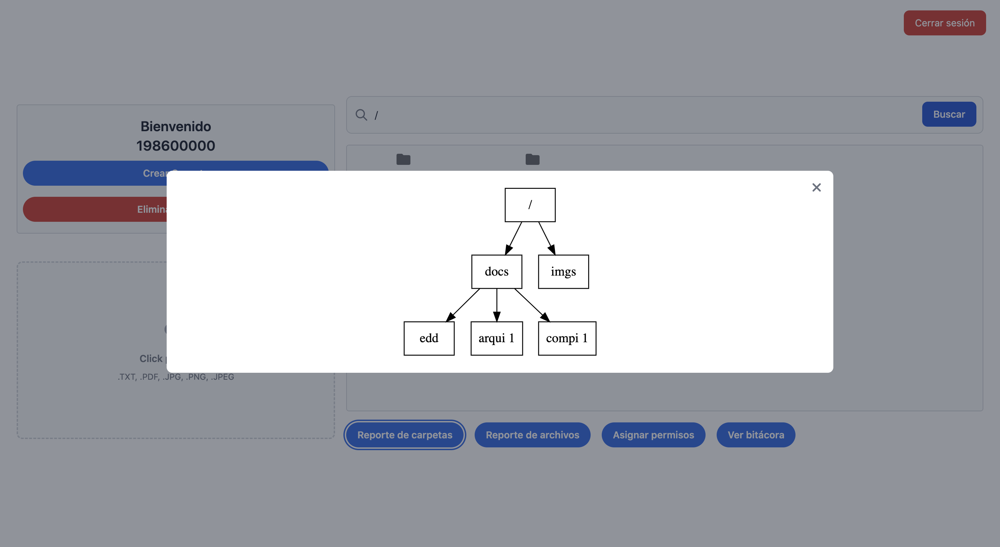

Al cargar archivos o carpetas, se mostrarán en la sección para visualizar el contenido de la carpeta actual.
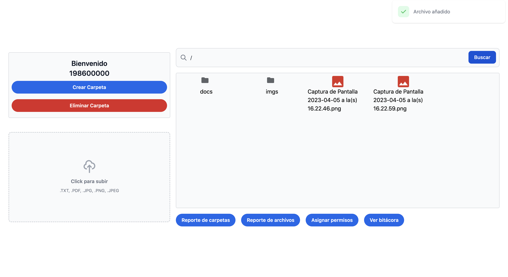

Al presionar el botón de `Reporte de archivos` se mostrará una imagen en forma de matriz que contiene los archivos.
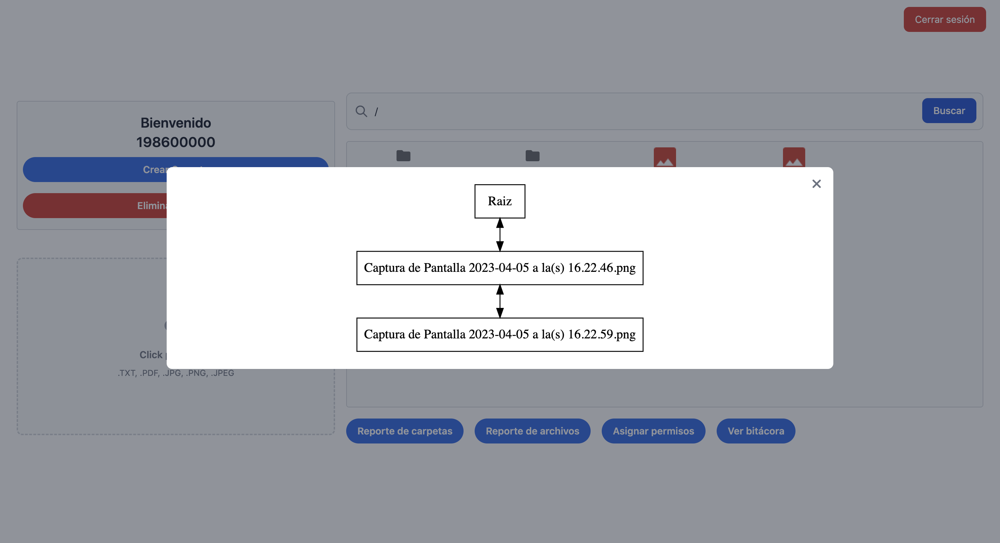

Al presionar el botón de `Asignar permisos` se abrirá una ventana modal donde se podrá asignar permisos a un archivo, ingresando el nombre del archivo y el usuario al que se le asignará el permiso. Los usuarios podrán ser de dos tipos: `Lectura` y/o `Escritura`.
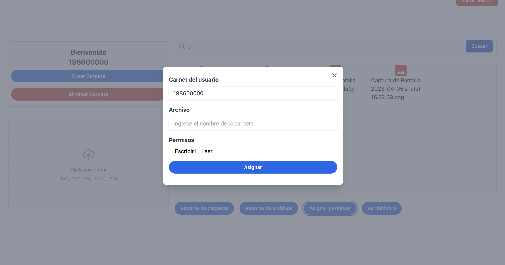

Al presionar el botón de `Ver actividad` se mostrará una lista con las acciones realizadas por el usuario.
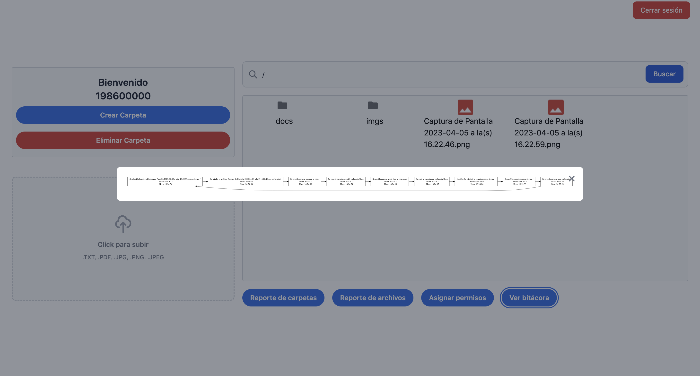

